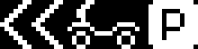
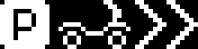

# LED badge

On the [36C3](https://events.ccc.de/congress/2019/wiki/index.php/Main_Page) [fossasia](https://fossasia.org) distributed some nice gadget (amongst others).

The dot matrix [LED badge](https://fossasia.com/product/led-badge/) has a resolution of 11 x 44 dots. It can display:

- static text with some effects
- scrolling text
- bitmap animations

# example animations

| name | preview |
|---|---|
| [scooter-parking-left.png](scooter-parking-left.png) |  |
| [scooter-parking-right.png](scooter-parking-left.png) |  |

